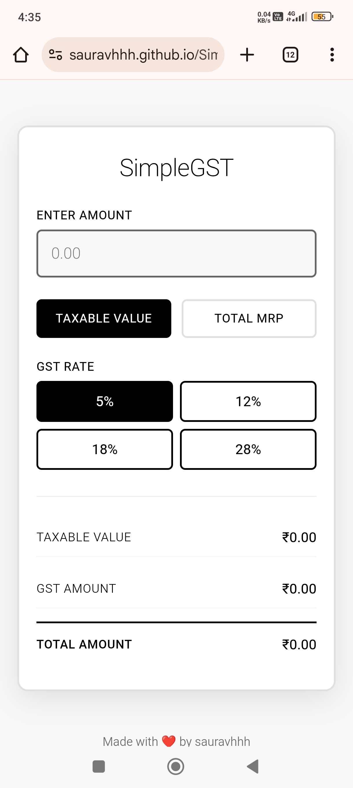

# SimpleGST 🧮

**SimpleGST** is a fast, mobile-friendly GST calculator for India that helps you instantly calculate tax amounts and final prices. Whether you're entering a taxable amount or MRP, SimpleGST handles all 4 GST slabs with precision.

---

## 🚀 Features

- **4 GST Slabs**: 5%, 12%, 18%, and 28% tax calculations
- **Dual Input Mode**: Calculate from taxable amount OR final MRP
- **Instant Results**: Real-time calculation as you type
- **Mobile Optimized**: Works perfectly on phones, tablets, and desktop
- **Clean Interface**: Minimalist design focused on clarity
- **Copy Results**: One-click copy for quick sharing
- **No Registration**: Use immediately without any setup

---

## 🖼️ Preview



*Clean, intuitive interface that works on any device*

---

## 📱 How It Works

### **Step 1**: Choose Your Input Type
- **Taxable Amount**: Enter amount before GST (for businesses)
- **MRP/Final Amount**: Enter total amount including GST (for consumers)

### **Step 2**: Select GST Slab
- **5%**: Essential items (food grains, medicine)
- **12%**: Standard items (computers, processed foods)
- **18%**: Most goods and services
- **28%**: Luxury items (cars, tobacco, aerated drinks)

### **Step 3**: Get Instant Results
- **GST Amount**: Exact tax calculated
- **Final Amount**: Total payable amount
- **Breakdown**: Clear itemization of charges

---

## 🛠️ Getting Started

1. **Clone the repository**
    ```
    git clone https://github.com/yourusername/SimpleGST.git
    cd SimpleGST
    ```

2. **Open `index.html`**
    ```
    # Just open in any browser - no server needed!
    open index.html
    ```

3. **Start calculating!**
    - Enter any amount
    - Select GST slab
    - Get instant results

---

## 💡 Example Calculations

### From Taxable Amount (₹1000):
- **5% GST**: ₹50 tax → **₹1050 total**
- **18% GST**: ₹180 tax → **₹1180 total**
- **28% GST**: ₹280 tax → **₹1280 total**

### From MRP (₹1180):
- **18% GST**: ₹180 tax ← **₹1000 taxable**

---

Made with ❤️ by sauravhhh

