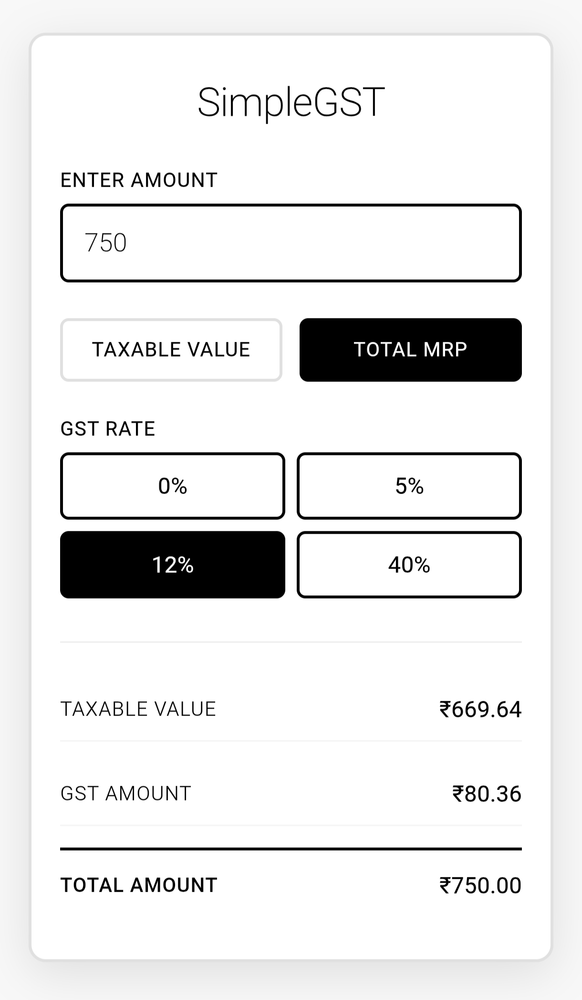

# SimpleGST 🧮

**SimpleGST** is a fast, mobile-friendly GST calculator for India that helps you instantly calculate tax amounts and final prices. Whether you're entering a taxable amount or MRP, SimpleGST handles all 4 GST slabs with precision.

---

## 🚀 Features

- **4 GST Slabs**: 0%, 5%, 12%, and 40% tax calculations
- **Dual Input Mode**: Calculate from taxable amount OR final MRP
- **Instant Results**: Real-time calculation as you type
- **Mobile Optimized**: Works perfectly on phones, tablets, and desktop
- **Clean Interface**: Minimalist design focused on clarity
- **No Registration**: Use immediately without any setup

---

## 🖼️ Preview



*Clean, intuitive interface that works on any device*

---

## 📱 How It Works

### **Step 1**: Choose Your Input Type
- **Taxable Amount**: Enter amount before GST (for businesses)
- **MRP/Final Amount**: Enter total amount including GST (for consumers)

### **Step 2**: Select GST Slab
- **0%**: Essential items (Fresh fruits and vegetables, milk, eggs, unpackaged foodgrains, salt, certain life-saving drugs, and educational items like pencils and notebooks.)
- **5%**: Merit items (Edible oils, packaged food items (like biscuits and pasta), basic household products (like soap and toothpaste), essential medicines, footwear priced up to ₹2,500, coal, and agricultural equipment.)
- **12%**: Standard items (Consumer durables (such as air conditioners, TVs, refrigerators, and washing machines), small cars and motorcycles (up to 350cc), cement, auto parts, capital goods, and mobile phones.)
- **40%**: Luxury items (Premium cars and motorcycles (over 350cc), luxury goods, carbonated and caffeinated beverages, tobacco, gambling, casinos, and certain lottery services.)

### **Step 3**: Get Instant Results
- **GST Amount**: Exact tax calculated
- **Final Amount**: Total payable amount
- **Breakdown**: Clear itemization of charges

---

## 🛠️ Getting Started

1. **Clone the repository**
    ```
    git clone https://github.com/yourusername/SimpleGST.git
    cd SimpleGST
    ```

2. **Open `index.html`**
    ```
    # Just open in any browser - no server needed!
    open index.html
    ```

3. **Start calculating!**
    - Enter any amount
    - Select GST slab
    - Get instant results

---

## 💡 Example Calculations

### From Taxable Amount (₹1000):
- **5% GST**: ₹50 tax → **₹1050 total**
- **12% GST**: ₹120 tax → **₹1120 total**
- **40% GST**: ₹400 tax → **₹1400 total**

### From MRP (₹1120):
- **12% GST**: ₹180 tax ← **₹1000 taxable**

---

Made with ❤️ by sauravhhh

